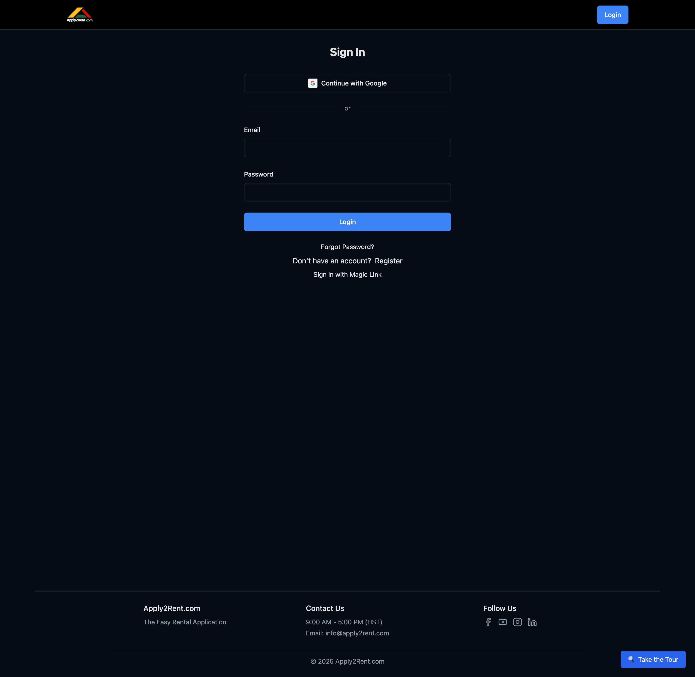

# Login

Learn how to securely access your Apply2Rent account and manage your login sessions.

## How to Login

### Step 1: Access the Login Page

1. Visit [Apply2Rent.com](https://apply2rent.com)
2. Click the **"Login"** button in the top right corner

### Step 2: Choose Your Login Method

Apply2Rent supports two login methods:

#### Option A: Google Sign-In (If you registered with Google)
1. Click **"Continue with Google"**
2. Select your Google account
3. You'll be automatically logged in

#### Option B: Email & Password
1. Enter your **email address**
2. Enter your **password**
3. Click **"Login"**

### Step 3: Access Your Dashboard

After successful login, you'll be redirected to:
- **Tenants:** Properties search page to browse available rentals
- **Landlords:** Property management dashboard

## Login Features

### Remember Me
- Your login session will persist across browser sessions
- You'll stay logged in until you manually logout
- For security, sessions automatically expire after extended inactivity

### Forgot Password
If you can't remember your password:

1. Click **"Forgot Password?"** on the login page
2. Enter your email address
3. Check your email for a password reset link
4. Follow the instructions to create a new password

> **Note:** Password reset links expire after 24 hours for security.

## Login Troubleshooting

### Common Login Issues

**"Invalid email or password"**
- Double-check your email address for typos
- Ensure you're using the correct password
- Try the "Forgot Password" option if needed
- Make sure Caps Lock is not enabled

**"Account not found"**
- Verify you're using the email address you registered with
- You may need to register first if you haven't created an account
- Check if you registered with Google instead of email/password

**Google Sign-In Issues**
- Ensure pop-ups are enabled for Apply2Rent
- Clear your browser cache and cookies
- Try disabling browser extensions temporarily
- Make sure you're selecting the correct Google account

**Browser Issues**
- Update your browser to the latest version
- Clear cache and cookies for Apply2Rent.com
- Try using an incognito/private browsing window
- Disable ad blockers that might interfere

### Account Security

**If you suspect unauthorized access:**
1. Change your password immediately
2. Review your recent application activity
3. Contact support if you notice suspicious activity
4. Consider enabling additional security measures

## After Login

### First Time Login
If this is your first time logging in:
1. You'll be prompted to complete your profile
2. Review and update your account information
3. Familiarize yourself with the navigation

### Regular Login
Returning users will see:
- **Dashboard:** Overview of your activity
- **Navigation Bar:** Quick access to main features
- **Notifications:** Any important updates or messages

## Staying Logged In

### Session Management
- Your session will remain active while you use Apply2Rent
- Sessions automatically extend with activity
- You'll be logged out after 30 days of inactivity for security

### Multiple Devices
- You can be logged in on multiple devices simultaneously
- Changes made on one device will sync to others
- For security, we recommend logging out on shared computers

## Logout

### How to Logout
1. Click your profile menu in the top right corner
2. Select **"Logout"**
3. You'll be redirected to the login page

### When to Logout
- Always logout when using shared or public computers
- Logout if you'll be away from your device for extended periods
- Consider logging out on mobile devices if they're not secured

## Security Best Practices

🔐 **Password Security**
- Use a unique, strong password for Apply2Rent
- Consider using a password manager
- Never share your login credentials

🛡️ **Account Safety**
- Always logout on shared computers
- Keep your browser updated
- Be cautious of phishing emails asking for login information

📱 **Mobile Security**
- Use device lock screens (PIN, fingerprint, etc.)
- Logout when switching between accounts
- Enable auto-lock on your mobile device

---

**Next Steps:** Once logged in, learn about [Property Search](property-search.md) to find rental properties.