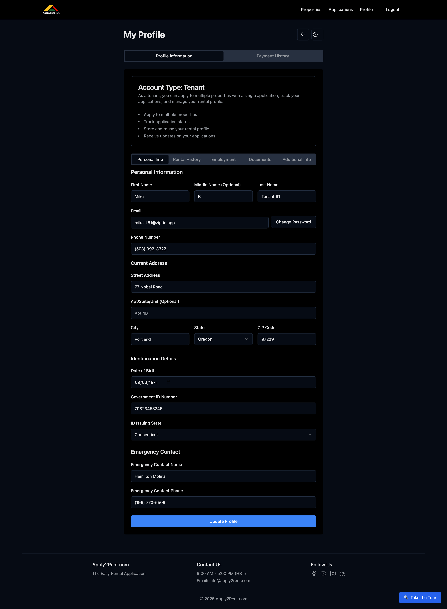

# Changing Your Password

Keeping your Apply2Rent.com account secure is essential. This guide will walk you through the process of changing your password safely and easily.

## Quick Overview

**Where to find it:** Profile page → Email field → "Change Password" button  
**What you need:** Current password and new password  
**Time required:** 2-3 minutes  

## Step-by-Step Instructions

### 1. Access Your Profile
1. Log in to your Apply2Rent.com account
2. Click **"Profile"** in the top navigation menu
3. You'll be taken to your profile dashboard

### 2. Locate the Change Password Option
1. Scroll down to the **Personal Information** section
2. Find the **Email field** in your contact details
3. Look for the **"Change Password"** button next to the email field
4. Click the **"Change Password"** button

### 3. Complete the Password Change Form
A dialog box will appear with the password change form:

#### Current Password
- Enter your **current password** in the first field
- This verifies you're the account owner

#### New Password
- Enter your **new password** in the second field
- Follow the password requirements below

#### Confirm New Password
- Re-enter your **new password** in the third field
- This prevents typos and ensures accuracy

### 4. Submit and Confirm
1. Review all fields for accuracy
2. Click **"Update Password"**
3. You'll see a confirmation message
4. Your password is now updated

## Password Requirements

### Security Standards
For optimal security, we recommend following these password guidelines:

✅ **Minimum 8 characters**  
✅ **At least one uppercase letter** (A-Z)  
✅ **At least one lowercase letter** (a-z)  
✅ **At least one number** (0-9)  
✅ **At least one special character** (!@#$%^&*)

### Strong Password Tips
🔒 **Use a unique password** - Don't reuse passwords from other accounts  
🔒 **Avoid personal information** - Don't use names, birthdays, or addresses  
🔒 **Consider a passphrase** - Multiple words with numbers and symbols  
🔒 **Use a password manager** - For generating and storing secure passwords  

### Examples of Strong Passwords
- `Blue$ky2024!` (not recommended - too simple)
- `MyF@voriteC0l0r!` (better)
- `Rental@pp2024$ecure!` (good)
- `C0mplex!P@ssw0rd#2024` (excellent)

## After Changing Your Password

### Immediate Actions
✅ **Log out and log back in** to test the new password  
✅ **Update password manager** if you use one  
✅ **Note the change** in your secure password storage  

### Security Recommendations
🔐 **Update other devices** where you're logged in  
🔐 **Consider changing passwords** on other accounts if they were similar  

## Troubleshooting

### Common Issues

#### "Current Password Incorrect"
- **Double-check your current password**
- **Check for caps lock** or keyboard language
- **Try typing slowly** to avoid typos
- **Reset your password** if you can't remember it

#### "New Password Doesn't Meet Requirements"
- **Review the password requirements** above
- **Add missing character types** (uppercase, lowercase, numbers, symbols)
- **Increase password length** if too short
- **Remove personal information** if detected

#### "Passwords Don't Match"
- **Carefully retype both new password fields**
- **Check for extra spaces** at the beginning or end
- **Ensure caps lock** is in the correct position
- **Copy and paste carefully** if using a password manager

#### Button Not Visible
- **Scroll down** in the Personal Information section
- **Look next to the email field** specifically
- **Try refreshing the page** if the button doesn't appear
- **Contact support** if the option is missing

### Password Reset Alternative
If you can't remember your current password:

1. **Go to the login page**
2. **Click "Forgot Password?"** or "Reset Password"
3. **Enter your email address**
4. **Check your email** for reset instructions
5. **Follow the email link** to create a new password

## Security Best Practices

### Regular Password Updates
🔄 **Change passwords every 3-6 months**  
🔄 **Update immediately** if you suspect a security breach  
🔄 **Use different passwords** for each account  
🔄 **Monitor account activity** regularly  

### Account Protection
🛡️ **Never share your password** with anyone  
🛡️ **Log out** when using shared computers  
🛡️ **Use secure networks** when changing passwords  
🛡️ **Report suspicious activity** immediately  

### Password Storage
📝 **Use a password manager** for secure storage  
📝 **Don't write passwords** on paper or sticky notes  
📝 **Avoid storing passwords** in email or text files  
📝 **Keep backup recovery methods** updated  

---

**Next Steps:** Once you've familiarized yourself with password management, learn about [Property Search](core/property-search.md) to find rental properties.