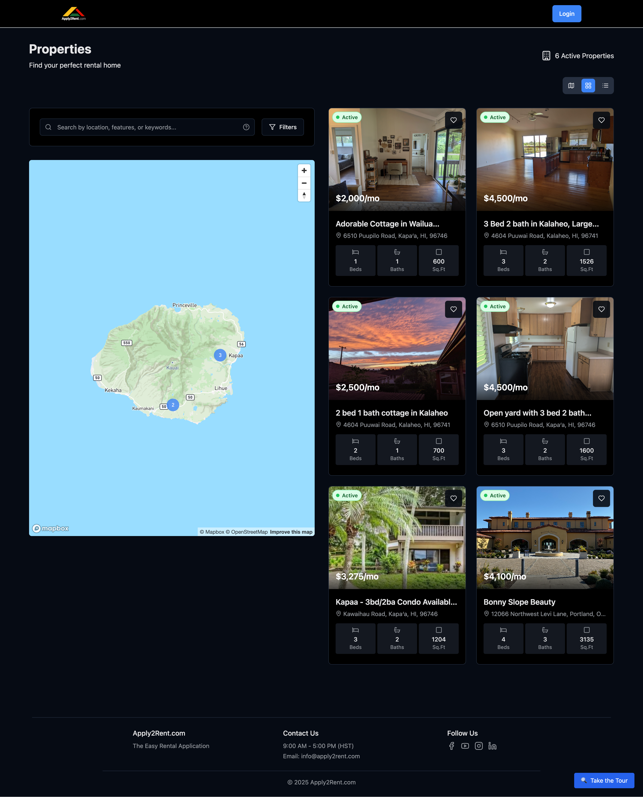

# Property Search

Discover how to efficiently search and browse rental properties on Apply2Rent using our powerful search tools and interactive map features.

## Getting Started with Property Search

After logging in, you'll land on the **Properties** page where you can browse all available rental listings.

## Search Interface Overview

### Main Search Bar
Located at the top of the properties page:
- **Search by location** - Enter city, neighborhood, or address
- **Search by keywords** - Find properties by features or amenities
- **Auto-suggestions** - Get location suggestions as you type

### View Toggle Options
Switch between different viewing modes:

#### 📍 **Map View** (Default)
- Interactive map showing property locations
- Zoom in/out to explore different areas
- Click property markers to see basic details
- Great for understanding neighborhood context

#### 📋 **List View**
- Traditional list format of all properties
- More properties visible at once
- Detailed information for each listing
- Easier to compare multiple properties quickly

#### 🔲 **Grid View**
- Card-based layout with property photos
- Visual browsing experience
- Property images prominently displayed
- Balance between map and list views

## Advanced Filtering

### Filter Options
Click the **"Filters"** button to access detailed search criteria:

#### **Price Range**
- Set minimum and maximum monthly rent
- Slider interface for easy adjustment
- View properties within your budget

#### **Property Type**
- House
- Apartment
- Condo
- Townhouse
- Other

#### **Bedrooms & Bathrooms**
- Select minimum number of bedrooms
- Choose minimum number of bathrooms
- Options from studio to 5+ bedrooms

#### **Property Features**
- Pet-friendly options
- Parking availability
- Laundry facilities
- Air conditioning
- And many more amenities

#### **Lease Terms**
- Short-term rentals
- Long-term leases
- Flexible lease options

### Applying Filters
1. Select your desired criteria
2. Click **"Apply Filters"**
3. Results update automatically
4. Clear filters anytime to see all properties

## Using the Interactive Map

### Map Navigation
- **Zoom:** Use mouse wheel or +/- buttons
- **Pan:** Click and drag to move around
- **Markers:** Each property has a location marker
- **Clustering:** Properties group together when zoomed out

### Property Markers
- **Green markers:** Available properties
- **Number badges:** Multiple properties in same area
- **Click markers:** Preview property details

### Map Features
- **Street view:** See neighborhood surroundings
- **Satellite view:** Aerial view of properties
- **Traffic overlay:** Current traffic conditions
- **Transit options:** Public transportation access

## Property Listings

### Property Card Information
Each property listing displays:

#### **Essential Details**
- **Monthly rent** - Prominently displayed
- **Address** - Full property location
- **Bed/Bath count** - Number of bedrooms and bathrooms
- **Square footage** - Living space area

#### **Property Status**
- **Active** - Available for applications
- **Pending** - Application under review
- **Rented** - No longer available

#### **Quick Actions**
- **❤️ Save** - Add to your saved properties
- **👁️ View Details** - See full property information
- **📋 Apply** - Start rental application (tenants only)

### Property Photos
- **Main photo** - Featured image for each listing
- **Photo carousel** - Multiple images when available
- **High-quality images** - Clear views of property features

## Search Tips & Best Practices

### Effective Searching
🎯 **Start Broad, Then Narrow**
- Begin with general location searches
- Use filters to refine results gradually
- Adjust criteria based on available options

🗺️ **Use Map View for Location**
- Understand commute distances
- Explore neighborhood amenities
- Check proximity to important locations

📋 **Compare Using List View**
- Side-by-side property comparison
- Quick scan of prices and features
- Efficient for reviewing many options

### Search Strategy Tips

**For First-Time Renters:**
1. Start with your desired neighborhood
2. Set a realistic budget range
3. Focus on must-have features first
4. Save interesting properties for later review

**For Experienced Renters:**
1. Use specific feature filters
2. Compare properties in similar areas
3. Look for unique amenities or benefits
4. Consider transportation and commute needs

## Search Results Management

### Sorting Options
Organize search results by:
- **Price:** Low to high or high to low
- **Date Added:** Newest or oldest first
- **Distance:** Closest to your search location
- **Bedrooms:** Smallest to largest

### Results Per Page
- Default: 20 properties per page
- Use pagination to browse through results
- Load more properties as you scroll

### No Results Found
If your search returns no properties:
- **Broaden location** - Try nearby neighborhoods
- **Adjust price range** - Increase budget if possible
- **Remove filters** - Temporarily remove some criteria
- **Check spelling** - Verify location names are correct

## Mobile Search Experience

### Mobile-Optimized Features
- **Touch-friendly** map controls
- **Swipe navigation** for property photos
- **Responsive design** adapts to screen size
- **Location services** can use your current location

### Mobile Search Tips
- Use location services for nearby searches
- Switch to list view for easier browsing on small screens
- Save properties while searching for later review on desktop

---

**Next Steps:** Once you find interesting properties, learn how to [Save Properties](saving-properties.md) for future reference.