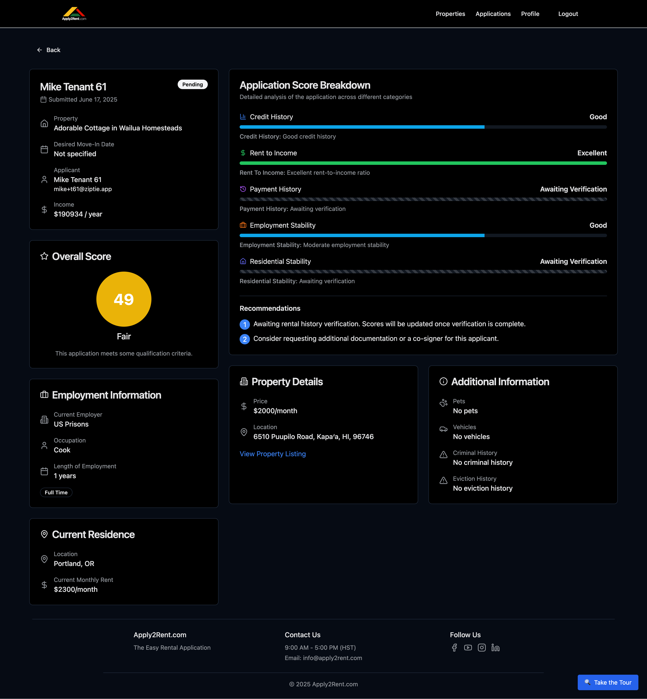

# Landlord Guide

Welcome to the comprehensive Landlord Guide for Apply2Rent.com! This section covers everything you need to know as a property owner or manager to list properties, review applications, and find qualified tenants.

## Overview

As a landlord on Apply2Rent.com, you can:
- **Create detailed property listings** with photos and descriptions
- **Receive qualified tenant applications** with comprehensive screening
- **Review tenant screening reports** and credit information
- **Manage multiple properties** from one dashboard
- **Connect with screened tenants** who meet your criteria

## Getting Started as a Landlord

### Your Landlord Journey
1. **[Profile Setup](landlord/profile-setup.md)** - Complete your landlord profile
2. **[Create Property Listings](landlord/creating-listings.md)** - Add your rental properties
3. **[Upload Photos](landlord/photos.md)** - Showcase your properties with great images
4. **[Property Descriptions](landlord/description.md)** - Write compelling property descriptions
5. **[Share Listing Flyers](landlord/flyers.md)** - Promote your properties
6. **[Review Applications](landlord/application-review.md)** - Evaluate tenant applications
7. **[Manage Listings](landlord/listing-management.md)** - Update and maintain your properties

## Landlord Account Benefits

### 🏡 **Professional Application Management**
- Create unlimited property listings
- Professional listing presentation
- Built-in property management tools
- Market your properties effectively

### 📊 **Comprehensive Tenant Screening**
Access detailed tenant information:
- **Credit reports and scores**
- **Background checks and criminal history**
- **Employment and income verification**
- **Rental history verification**
- **Overall tenant scoring and recommendations**

### 🔍 **Quality Applications**
Receive pre-screened applications:
- **Income verified** - Tenants meet basic requirements
- **Complete profiles** - All necessary information provided
- **Ready to review** - No incomplete or partial applications
- **Standardized format** - Easy comparison between applicants

### 📧 **Application Management**
- **Real-time notifications** when applications are received
- **Application tracking** and status management
- **Direct communication** with applicants
- **Decision tracking** and follow-up tools

## Property Listing Features

### Complete Property Information
Your listings can include:
- **Detailed property specifications** - Bedrooms, bathrooms, square footage
- **High-quality photos** - Professional property photography
- **Comprehensive amenities** - Full list of property features
- **Location information** - Interactive maps and neighborhood details
- **Rental terms** - Lease duration, deposits, pet policies

### Property Management Tools
- **Listing status control** - Active, paused, or rented
- **Application management** - Track and review applications
- **Applicant communication** - Applicant emails available for direct interaction with potential tenants

## Tenant Screening Process

### Automatic Tenant Screening
When tenants apply to your properties, Apply2Rent.com automatically provides:

- **Credit Information**
- **Background Checks**
- **Employment Verification**
- **Rental History Information** with previous landlord verificaiton

### Tenant Scoring System
Apply2Rent.com provides a comprehensive tenant score including:
- **Overall numerical score** (0-100 scale)
- **Category breakdowns** - Credit, employment, rental history
- **Risk assessment** - Low, medium, or high risk
- **Recommendations** - Approval suggestions based on criteria

## Application Review Process

### Receiving Applications
When tenants apply to your properties:
1. **Instant notification** - Email and in-app alerts
2. **Complete application** - All tenant information provided
3. **Screening results** - Comprehensive background information
4. **Review dashboard** - Easy-to-use application evaluation tools

### Review Tools
Evaluate applications with:
<!-- - **Side-by-side comparison** of multiple applicants -->
- **Detailed tenant profiles** - Complete financial and rental history
- **Risk assessments** - Professional evaluation of tenant quality
- **Communication tools** - Direct contact with applicants

### Decision Making
Make informed decisions with:
- **Complete information** - No surprises or hidden issues
- **Professional recommendations** - Based on industry standards
- **Legal compliance** - Fair housing law adherence
- **Documentation** - Complete application records

## Property Types and Specialties

### Residential Properties
Apply2Rent.com works for all residential rental types:
- **Single-family homes** - Houses and townhouses
- **Apartments** - Units in multi-family buildings
- **Condominiums** - Individual condo rentals
- **Rooms** - Individual room rentals in shared housing

### Property Management Scale
Whether you have:
- **Single property** - Individual landlords with one rental
- **Multiple properties** - Small portfolio management
- **Property management companies** - Professional management firms
- **Institutional landlords** - Large-scale property management

## Landlord Success Tips

### Creating Attractive Listings
🏠 **Professional Photography**
- High-quality, well-lit photos
- Multiple angles and rooms
- Exterior and interior shots
- Neighborhood highlights

📝 **Compelling Descriptions**
- Highlight unique features and amenities
- Describe neighborhood benefits
- Include practical information (parking, utilities)
- Use professional, welcoming language

💰 **Competitive Pricing**
- Research local market rates
- Consider property condition and amenities
- Factor in demand for your area
- Be realistic about market conditions

### Effective Tenant Screening
🔍 **Set Clear Criteria**
- Minimum income requirements (typically 3x rent)
- Credit score minimums
- Background check standards
- Rental history requirements

⚡ **Respond Quickly**
- Review applications promptly
- Communicate decisions clearly
- Provide feedback when possible
- Maintain professional communication

### Legal Compliance
📋 **Fair Housing Laws**
- Equal treatment of all applicants
- Non-discriminatory practices
- Consistent evaluation criteria
- Proper documentation

🏛️ **Local Regulations**
- Understand local rental laws
- Comply with security deposit limits
- Follow proper eviction procedures
- Maintain required insurance coverage

## Getting Support

### Landlord Resources
- **Application review guidance** - Best practices for tenant evaluation
- **Legal compliance** - Fair housing and rental law information
- **Property marketing** - Tips for attracting quality tenants
- **Tenant communication** - Professional correspondence templates

### Customer Support
- **Email support** - info@apply2rent.com
- **Phone support** - Business hours (9 AM - 5 PM HST)
- **Knowledge base** - Comprehensive guides and FAQs

## Success Metrics

<!-- ### Track Your Performance
Monitor your rental success:
- **Listing views** - How many people view your properties
- **Application volume** - Number of applications received
- **Application quality** - Average tenant scores
- **Time to rent** - How quickly properties rent
- **Tenant retention** - Long-term tenant success -->

### Optimize Your Listings
Improve results by:
- **Updating photos** regularly
- **Refreshing descriptions** with new amenities
- **Adjusting pricing** based on market conditions
- **Responding to feedback** from prospective tenants

---

**Ready to get started?** Begin by [Setting Up Your Landlord Profile](landlord/profile-setup.md) to create your property management account.