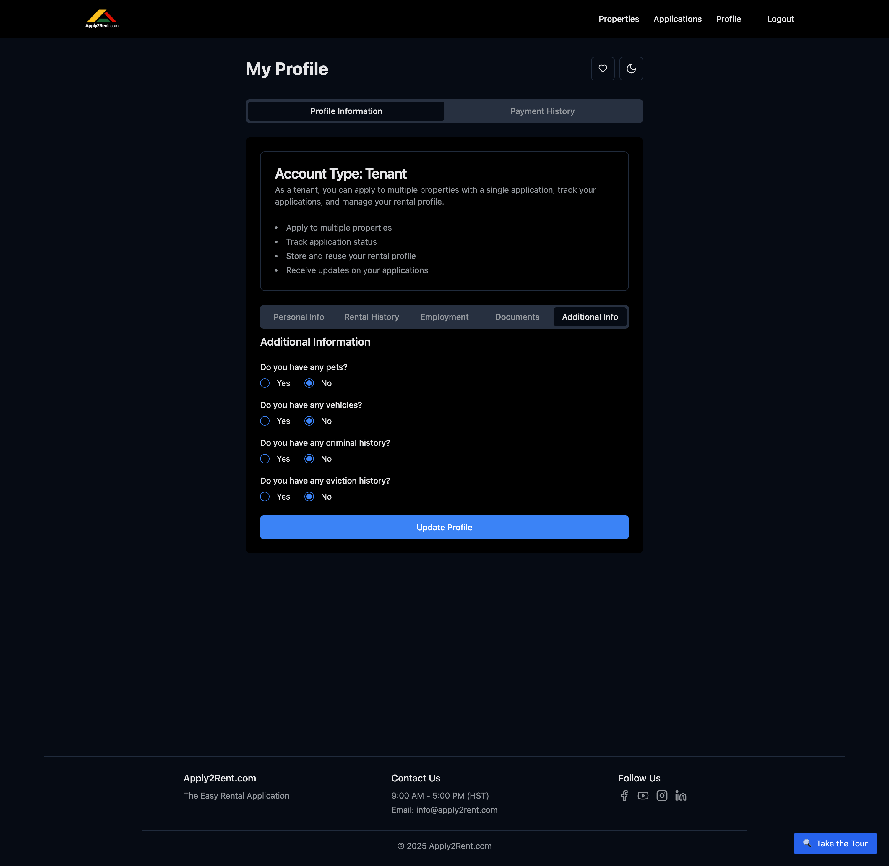

# Additional Information

The Additional Information section captures important details about pets, vehicles, background history, and special circumstances that landlords need to know for your application.

## Why Additional Information Matters

### Landlord Decision Making
This section helps landlords:
- **Assess property compatibility** - Pets, vehicles, lifestyle
- **Understand potential risks** - Background disclosures
- **Plan for move-in** - Special accommodations or requirements
- **Comply with legal requirements** - Fair housing laws and disclosures

### Honesty and Transparency
Being upfront about additional information:
- **Builds trust** with potential landlords
- **Prevents surprises** during background checks
- **Demonstrates integrity** and responsibility
- **Helps find compatible properties** and landlords

## Pet Information

### Why Pet Information Is Important
- **Property restrictions** - Many properties have pet policies
- **Additional deposits** - Pet deposits or monthly pet rent
- **Insurance requirements** - Some breeds require special coverage
- **Neighbor considerations** - Noise, allergies, and comfort

### Pet Details to Include

#### **Pet Type and Breed**
- **Dog** - Include specific breed (German Shepherd, Golden Retriever, etc.)
- **Cat** - Indoor, outdoor, or indoor/outdoor
- **Other pets** - Birds, fish, reptiles, small mammals
- **Mixed breeds** - List known breed combinations

#### **Pet Size and Weight**
- **Small** - Under 25 pounds
- **Medium** - 25-60 pounds  
- **Large** - 60-100 pounds
- **Extra Large** - Over 100 pounds
- **Exact weight** if known

#### **Pet Age and Training**
- **Age of pet** - Puppies vs. adult pets
- **House training status** - Fully trained, in training, or not trained
- **Obedience training** - Basic commands, professional training
- **Behavioral notes** - Temperament, special needs

#### **Veterinary Information**
- **Vaccinations current** - Up-to-date on required shots
- **Spayed/neutered** - Reduces certain landlord concerns
- **Health conditions** - Chronic issues that might affect tenancy
- **Veterinarian contact** - For reference if needed

### Service and Emotional Support Animals

#### **Legal Distinctions**
- **Service animals** - Trained to perform specific tasks for disabilities
- **Emotional support animals** - Provide comfort for mental health conditions
- **Therapy animals** - Visit facilities to provide comfort to others
- **Regular pets** - No special training or legal protections

#### **Required Documentation**
- **Service animals** - Training certification, task documentation
- **Emotional support animals** - Letter from licensed mental health professional
- **Verification letters** - Must be current (typically within 1 year)
- **Training records** - Documentation of specialized training

#### **Fair Housing Rights**
- **No pet deposits** - Service and ESA animals are not pets
- **Reasonable accommodations** - Landlords must allow in most cases
- **Breed restrictions** - May not apply to legitimate service animals
- **Documentation required** - Landlords can request proper verification

### No Pets
If you don't have pets:
- **Clearly indicate** "No pets" 
- **Mention willingness** to follow pet policies
- **Note allergies** if relevant to roommate situations
- **Future pet plans** - If you might get pets during tenancy

## Vehicle Information

### Why Vehicle Information Matters
- **Parking availability** - Properties have limited parking spaces
- **Parking assignments** - Reserved spots vs. general parking
- **Additional costs** - Parking fees or garage rentals
- **Property access** - Vehicle size restrictions for some properties

### Vehicle Details

#### **Vehicle Information**
- **Make and model** - Honda Civic, Ford F-150, etc.
- **Year** - Age of vehicle
- **Color** - For parking identification
- **License plate** - If comfortable sharing

#### **Vehicle Type**
- **Sedan** - Standard passenger car
- **SUV/Crossover** - Larger passenger vehicles
- **Truck** - Pickup trucks (note size - compact, full-size)
- **Van** - Minivan or cargo van
- **Motorcycle** - Different parking requirements
- **RV/Trailer** - Special parking considerations

#### **Parking Needs**
- **Covered parking** - Garage or carport preferred
- **Security** - Gated or secure parking areas
- **Size requirements** - Oversized vehicles need special spaces
- **Multiple vehicles** - Additional parking space needs
- **Visitor parking** - Availability for guests

### No Vehicle
If you don't own a vehicle:
- **Indicate "No vehicle"** clearly
- **Transportation methods** - Public transit, rideshare, walking
- **Future vehicle plans** - If you might get a car during tenancy
- **Parking not needed** - Reduces landlord parking concerns

## Background Disclosures

### Legal Requirements
Most states require disclosure of:
- **Criminal history** - Convictions and arrests
- **Eviction history** - Previous rental evictions
- **Bankruptcy** - Financial insolvency filings
- **Landlord disputes** - Legal issues with previous landlords

### Criminal History

#### **What to Disclose**
Be honest about:
- **Felony convictions** - More serious criminal offenses
- **Misdemeanor convictions** - Lesser criminal offenses
- **Pending charges** - Current criminal cases
- **Arrests without conviction** - If required by local law

#### **How to Disclose Criminal History**
1. **Be honest and upfront** - Don't try to hide information
2. **Provide context** - Explain circumstances briefly
3. **Show rehabilitation** - Demonstrate positive changes
4. **Include timeframe** - When incidents occurred
5. **Focus on growth** - How you've improved since then

#### **Example Disclosure**
"I have a misdemeanor conviction for DUI from 2019. I completed all court requirements including community service and alcohol education. I have maintained a clean record since then and learned valuable lessons about responsibility."

### Eviction History

#### **Eviction Disclosure**
If you've been evicted:
- **Date of eviction** - When it occurred
- **Reason for eviction** - Non-payment, lease violation, etc.
- **Amount owed** - If any money was owed
- **Resolution** - How the matter was settled
- **Lessons learned** - How you've improved

#### **Avoiding Future Evictions**
Show landlords you've changed:
- **Improved financial situation** - Better income or budgeting
- **Better communication** - Learned to communicate with landlords
- **Financial planning** - Emergency fund for rent payments
- **Character references** - People who can vouch for improvement

<!-- ### Bankruptcy History

#### **Bankruptcy Disclosure**
If you've filed for bankruptcy:
- **Type of bankruptcy** - Chapter 7, Chapter 13, etc.
- **Filing date** - When bankruptcy was filed
- **Discharge date** - When bankruptcy was completed
- **Circumstances** - Brief explanation of what led to bankruptcy
- **Current financial status** - How your situation has improved -->

### No Criminal or Eviction History
If you have a clean background:
- **Clearly Indicate** "No criminal history"
- **Indicate** "No eviction history"
- **Emphasize** your clean record as a positive factor

<!-- ## Special Circumstances

### Medical Accommodations
If you need special accommodations:
- **Accessibility requirements** - Wheelchair access, grab bars
- **Service animal needs** - Access for service animals
- **Medical equipment** - Space for medical devices
- **Caregiver access** - Need for caregiver visits

### Family Situation
Relevant family information:
- **Children** - Number and ages
- **Custody arrangements** - Visitation schedules
- **Family size** - Total household members
- **Special needs** - Any family member needs

### Work Requirements
Job-related considerations:
- **Home office** - Need for dedicated workspace
- **Shift work** - Unusual hours that might affect neighbors
- **Business equipment** - Professional equipment storage
- **Client visits** - Business meetings at home

### Lifestyle Factors
Other considerations:
- **Smoking** - Tobacco or other substances
- **Music/instruments** - Sound considerations
- **Hobbies** - Activities that might affect property or neighbors
- **Religious observances** - Practices that might affect tenancy -->

## Completing Additional Information

### Section Strategy
1. **Be comprehensive** - Include all relevant information
2. **Be honest** - Transparency builds trust
3. **Provide context** - Explain circumstances when helpful
4. **Focus on positives** - Emphasize how you've grown or improved
5. **Keep it brief** - Provide facts without over-explaining

### Review Before Submitting
Before finalizing this section:
- **Double-check accuracy** - All information is correct
- **Consider completeness** - Haven't missed anything important
- **Review tone** - Professional and honest presentation
- **Get feedback** - Ask trusted friends or family to review

### Updates and Changes
Keep this section current:
- **New pets** - Add if you get pets during tenancy search
- **Vehicle changes** - Update if you buy or sell vehicles
- **Address changes** - Update background disclosures if legally required
- **Resolved issues** - Update status of any ongoing legal matters

## Impact on Applications

### How Additional Information Affects Applications

#### **Positive Impacts**
- **Honesty appreciated** - Landlords value transparency
- **Compatibility matching** - Find landlords who accept your situation
- **Trust building** - Demonstrates integrity and responsibility
- **Legal compliance** - Meets disclosure requirements

#### **Potential Challenges**
- **Property restrictions** - Some properties may not be suitable
- **Additional deposits** - Pets or other factors may require extra costs
- **Screening delays** - Complex situations may take longer to review
- **Fewer options** - Some landlords may have strict policies

### Maximizing Your Chances
Despite potential challenges:
- **Highlight positives** - Emphasize responsible pet ownership, clean driving record
- **Provide references** - Character references who can vouch for you
- **Show stability** - Demonstrate how you've overcome past challenges
- **Be proactive** - Address concerns before landlords ask

---

**Next Steps:** With your profile complete, learn about [Applying to Properties](tenant/applying.md) to start submitting rental applications.