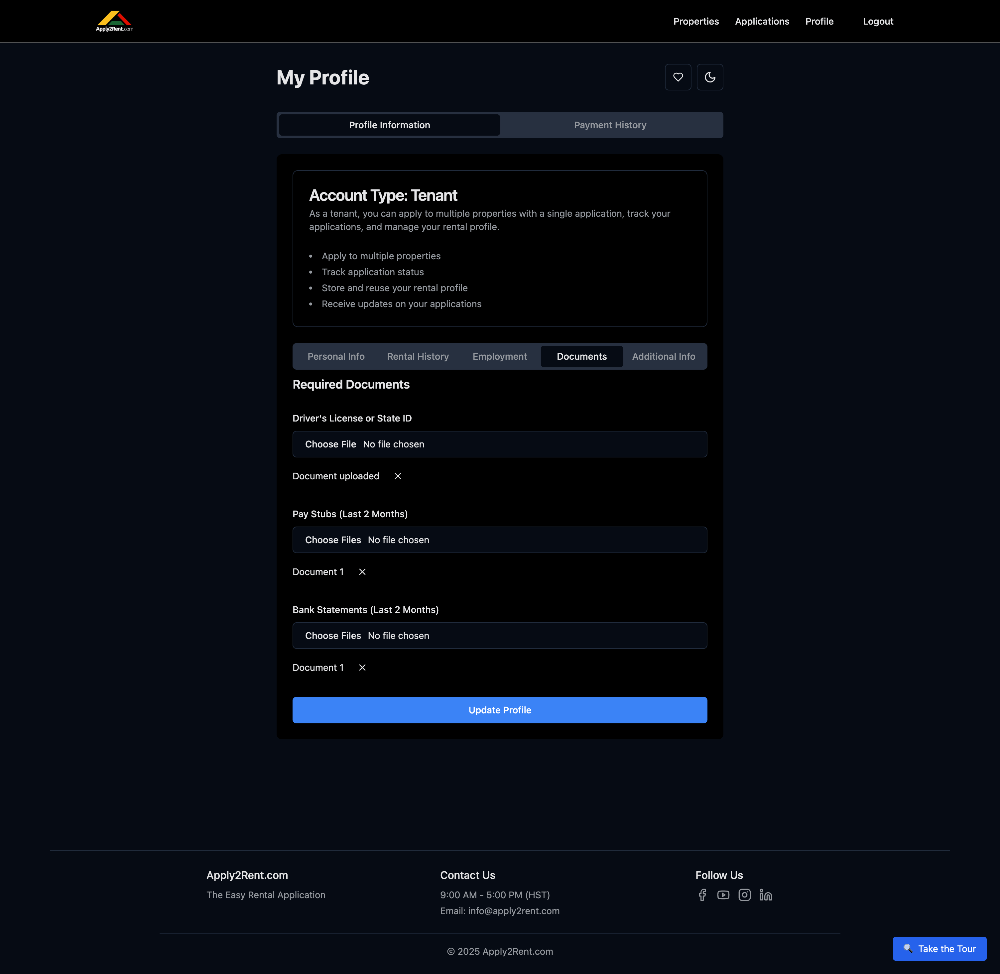

# Documents Upload

Document verification is a critical part of the rental application process. Proper documentation helps speed up your application and increases your chances of approval.

## Required Documents Overview

Apply2Rent.com requires specific documents to verify your identity, income, and financial stability:

### **Essential Documents**
1. **Government-issued Photo ID** - Driver's license or state ID
2. **Pay Stubs** - Last 2 months of income verification
3. **Bank Statements** - Last 2 months of financial records

### **Additional Documents** (may be required)
- Employment offer letters
- Tax returns (self-employed)
- Additional income verification
- Previous rental documentation
- Character references

## Government-Issued Photo ID

### Acceptable Forms of ID

#### **Driver's License**
- **Current and valid** - Not expired
- **Clear photo** of your face
- **Readable text** - Name, address, ID number visible
- **Both sides** if information is on back

#### **State-Issued ID**
- **Non-driver identification card** from any U.S. state
- **Current and valid** - Check expiration date
- **Clear, readable scan** or photo

#### **Other Acceptable IDs**
- **U.S. Passport** - Information page only
- **Military ID** - Active duty or veteran
- **Permanent resident card** - Green card

### ID Document Requirements
- **High-quality scan** or clear photo
- **All four corners** visible in image
- **Text must be readable** - No blurry or dark photos
- **No shadows or glare** covering information
- **Color preferred** but black and white acceptable

### Common ID Issues
❌ **Expired identification** - Renew before applying  
❌ **Blurry or unclear** photos  
❌ **Missing corners** or partial images  
❌ **Covered by shadows** or reflections  
❌ **Wrong file format** - Use PDF, JPG, or PNG  

## Pay Stubs

### Pay Stub Requirements

#### **Timeframe**
- **Last 2 months** of pay stubs required
- **Most recent available** pay periods
- **Consecutive pay periods** preferred
- **Year-to-date totals** should be included

#### **Information Visibility**
Your pay stubs must clearly show:
- **Your full name** matching your ID
- **Employer name** and address
- **Pay period dates** 
- **Gross income** (before taxes)
- **Year-to-date earnings**
- **Pay date** or check date

### Types of Pay Stubs

#### **Electronic Pay Stubs**
- **Download from employer portal** in PDF format
- **Include all pages** if multi-page document
- **Ensure security watermarks** are visible if present

#### **Physical Pay Stubs**
- **Scan or photograph** clearly
- **All text must be readable**
- **Include any additional pages** or attachments

#### **Direct Deposit Statements**
- **Bank statements** showing payroll deposits
- **Include employer name** in transaction description
- **Consistent deposit amounts** and timing

### Self-Employed Income Documentation
If you're self-employed:
- **Last 2 years tax returns** (complete returns)
- **Bank statements** showing business income
- **Profit and loss statements**
- **1099 forms** from clients
- **Business license** or registration

### Multiple Income Sources
If you have multiple jobs:
- **Pay stubs from all employers**
- **Include all regular income** sources
- **Label each document** clearly
- **Calculate total income** accurately

## Bank Statements

### Bank Statement Requirements

#### **Timeframe and Source**
- **Last 2 months** of statements
- **Primary checking account** where you receive income
- **Complete statements** - All pages included
- **Official bank statements** - Not transaction summaries

#### **Required Information**
Bank statements must show:
- **Your name** matching application
- **Account number** (partial okay for security)
- **Bank name** and contact information
- **Statement period dates**
- **All transactions** during the period
- **Beginning and ending balances**

### Types of Bank Statements

#### **Electronic Statements**
- **Download PDF** from online banking
- **Official bank letterhead** and formatting
- **All pages** of multi-page statements
- **Digital signatures** or security features

#### **Paper Statements**
- **Scan all pages** clearly
- **Include bank letterhead** and account details
- **Readable transaction details**
- **No pages missing** from statement period

### What Banks Statements Show Landlords
- **Income deposits** - Regular payroll or business income
- **Account balance** - Financial stability and reserves
- **Payment history** - Rent, utilities, and other obligations
- **Financial habits** - Spending patterns and money management
- **Overdrafts or fees** - Potential financial management issues

### Bank Statement Privacy
To protect sensitive information:
- **Redact account numbers** if desired (leave last 4 digits)
- **Keep transaction details** visible for verification
- **Don't redact income deposits** - These need to be verified
- **Maintain statement integrity** - Don't alter or modify

## Document Upload Process

### How to Upload Documents

#### **File Format Requirements**
- **PDF** - Preferred format for multi-page documents
- **JPG/JPEG** - Acceptable for photos of documents
- **PNG** - Good for scanned documents

#### **Upload Steps**
1. **Navigate to Documents section** in your profile
2. **Select document type** from dropdown
3. **Click "Choose File"** or drag-and-drop
4. **Wait for upload completion** 
5. **Verify document appears** in your profile

#### **Mobile Upload**
- **Use device camera** to photograph documents
- **Ensure good lighting** and clear focus
- **Take multiple photos** if document is large
- **Upload immediately** while photos are clear

### Document Organization

#### **File Naming**
Use clear, descriptive names:
- "John_Smith_Drivers_License.pdf"
- "Pay_Stub_March_2025.pdf"
- "Bank_Statement_February_2025.pdf"
- "Employment_Offer_Letter.pdf"

<!-- #### **Document Labels**
Apply2Rent.com allows you to label uploads:
- **Driver's License** - Government ID
- **Pay Stub** - Income verification
- **Bank Statement** - Financial verification
- **Tax Return** - Self-employment income
- **Other** - Specify in description -->

## Additional Documents

### When Additional Documents Are Needed

#### **Employment Verification**
- **Offer letter** for new jobs
- **Employment verification letter** from HR
- **Contract** for contract workers
- **Business license** for self-employed

#### **Income Verification**
- **Tax returns** for variable income
- **Social Security award letter**
- **Pension statements**
- **Investment account statements**
- **Alimony or child support documentation**

#### **Rental History**
- **Previous lease agreements**
- **Landlord reference letters**
- **Rent payment receipts**
- **Security deposit return receipts**

### Special Circumstances

#### **International Documents**
- **Translated documents** may be required
- **Notarized translations** for official documents
- **Equivalent foreign documentation**
- **Immigration documents** if applicable

#### **Recent Life Changes**
- **Marriage certificate** for name changes
- **Divorce decree** for name or income changes
- **Death certificate** for inheritance income
- **Medical documentation** for disability income

## Document Security and Privacy

### How Documents Are Protected
🔒 **Encrypted storage** - All documents encrypted at rest  
🔒 **Secure transmission** - SSL encryption during upload  
🔒 **Limited access** - Only you and verified landlords  
🔒 **Audit trails** - Track who accesses your documents  

### Document Retention
- **Stored securely** during active account period
- **Automatic deletion** if account is closed
- **Backup copies** for system reliability
- **Compliance with** data protection regulations

### Who Can See Your Documents
- **You** - Full access to manage your documents
- **Landlords** - May gain access when you apply to their properties
- **Apply2Rent.com staff** - For verification and support only
- **No third parties** - Never sold or shared inappropriately

## Document Verification Process

### Verification Steps
1. **Automated checking** - System verifies document format and readability
2. **Manual review** - Staff may review documents for completeness
3. **Third-party verification** - Employment and income may be verified
4. **Landlord review** - Landlords review documents during application

### Verification Timeline
- **Immediate** - Automated format checking
- **24-48 hours** - Manual review if needed
- **Varies** - Third-party verification timing
- **Application dependent** - Landlord review timing

### Common Verification Issues
- **Unclear documents** - Poor scan quality
- **Missing information** - Incomplete documents
- **Outdated documents** - Expired or old documents
- **Inconsistent information** - Mismatched details across documents

## Troubleshooting Document Upload

### Common Upload Problems

**"File too large"**
- **Compress PDF** using online tools
- **Reduce image quality** for photos
- **Split multi-page** documents if necessary
- **Convert to different format** if needed

**"Unsupported file format"**
- **Convert to PDF, JPG, or PNG**
- **Avoid DOC, TXT, or other formats**
- **Use online conversion tools** if needed

**"Upload failed"**
- **Check internet connection**
- **Try different browser** or device
- **Clear browser cache** and cookies
- **Contact support** if problem persists

**"Document not readable"**
- **Retake photo** with better lighting
- **Use scanner** instead of camera if possible
- **Ensure all text is visible** and clear
- **Check for shadows or glare**

### Getting Help with Documents
- **Live chat** - Available during business hours
- **Email support** - info@apply2rent.com
- **Help guides** - Step-by-step upload instructions
- **Video tutorials** - Visual upload demonstrations

---

**Next Steps:** Complete your profile with [Additional Information](tenant/additional-info.md) about pets, vehicles, and background details.