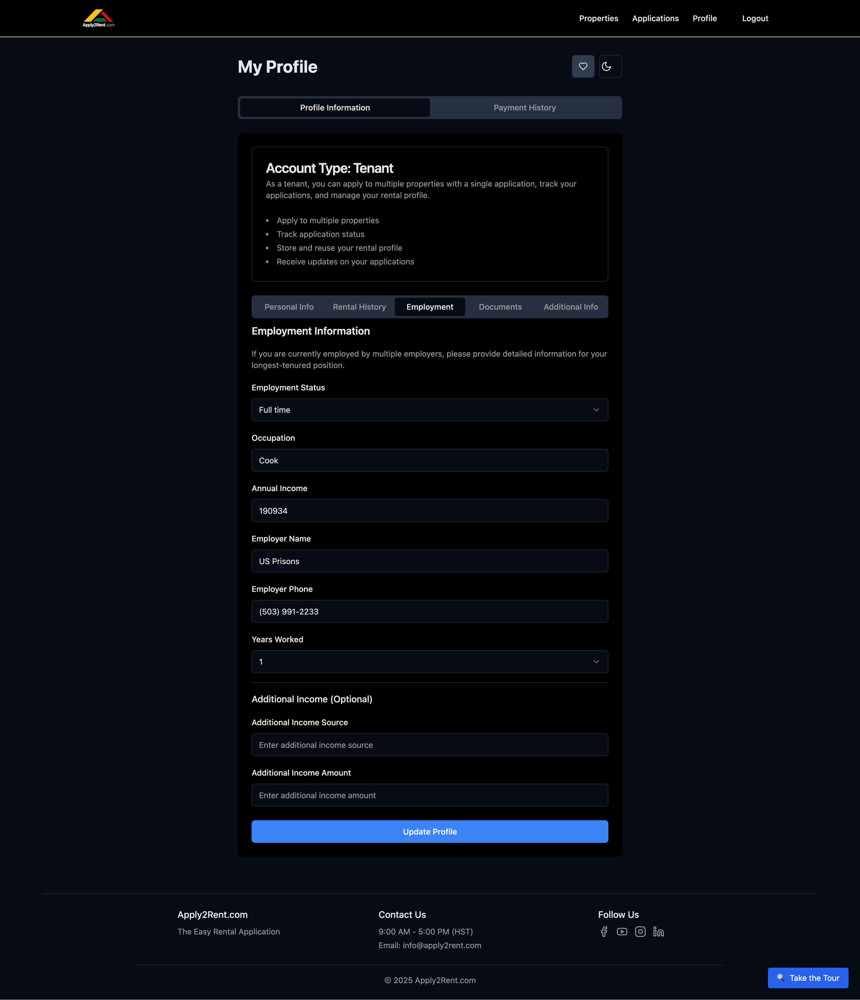

# Employment Information

Your employment information is crucial for rental applications. Landlords use this data to verify your ability to pay rent consistently and evaluate your financial stability.

## Why Employment Information Matters

### Landlord Requirements
Most landlords require tenants to have:
- **Stable employment** - Regular, ongoing work
- **Sufficient income** - Typically 2.5-3x monthly rent
- **Verifiable employment** - Contact information for verification
- **Income documentation** - Pay stubs, offer letters, tax returns

### Income-to-Rent Ratio
**Standard requirement:** Monthly gross income ≥ 2.5-3x monthly rent
- **$2,000/month rent** → Need $5,000-$6,000/month income
- **$1,500/month rent** → Need $3,750-$4,500/month income
- **$3,000/month rent** → Need $7,500-$9,000/month income

## Required Employment Fields

### Employment Status
Select your current employment situation:

#### **Full Time Employment**
- Working 35+ hours per week
- Regular, ongoing position
- W-2 employee with benefits
- Most common and preferred by landlords

#### **Part Time Employment**
- Working less than 35 hours per week
- May need to show additional income sources
- Include multiple part-time jobs if applicable

#### **Self Employed**
- Independent contractor or business owner
- 1099 income or business profits
- May require additional documentation (tax returns, bank statements)

<!-- #### **Unemployed**
- Currently not working
- May still qualify with other income sources
- Consider co-signer or guarantor options

#### **Student**
- Full-time student status
- May qualify with financial aid, family support, or part-time work
- Include student loan information if applicable

#### **Retired**
- Receiving retirement income
- Include pension, Social Security, 401k distributions
- Fixed income may be viewed favorably -->

### Current Employment Details

#### **Employer Name**
- **Official company name** as it appears on pay stubs
- **Complete legal name** of the business
- **Avoid abbreviations** unless that's the official name

<!-- #### **Employer Address**
- **Physical business address** (not P.O. Box)
- **Complete address** with city, state, ZIP
- **Should match pay stub address** -->

#### **Employer Phone Number**
- **Main business phone number**
- **HR department number** if large company
- **Direct supervisor number** if appropriate
- **Number that can verify employment**

#### **Job Title/Occupation**
- **Official job title** as shown on pay stubs
- **Exact title** from your employee records
- **Avoid casual descriptions** - use formal titles

<!-- #### **Supervisor Name**
- **Direct supervisor's full name**
- **Someone who can verify your employment**
- **Available during business hours**
- **Aware they may be contacted** -->

#### **Annual Gross Income**
- **Before-tax income** from this job
- **Annual amount** even if paid hourly
- **Include overtime** if regular and consistent
- **Base salary** plus regular bonuses

#### Years at Current Job
Select how long you've been with your current employer:
- **Less than 6 months** - May need previous employment info
- **6 months to 1 year** - Generally acceptable
- **1-2 years** - Good employment stability
- **2+ years** - Excellent employment history

## Additional Income Sources

### When to Include Additional Income
Include if you have:
- **Second job or side business**
- **Investment income** (dividends, rental property)
- **Government benefits** (Social Security, disability)
- **Financial support** from family
- **Alimony or child support**
- **Student financial aid**

### Additional Income Details

#### **Income Source Description**
Be specific about the source:
- "Part-time retail job at XYZ Store"
- "Freelance graphic design work"
- "Social Security disability benefits"
- "Investment dividends from portfolio"
- "Child support from ex-spouse"

#### **Monthly Amount**
- **Average monthly income** from this source
- **Conservative estimate** if income varies
- **Gross amount** before taxes
- **Consistent, ongoing income** only

### Documentation for Additional Income
You may need to provide:
- **Second job pay stubs**
- **1099 forms** for contract work
- **Bank statements** showing deposits
- **Award letters** for government benefits
- **Court orders** for support payments

<!-- ## Employment History

### Previous Employment (Optional but Recommended)
If you've been at your current job less than 2 years, include previous employment:

#### **Previous Employer Details**
- Company name and address
- Job title and responsibilities
- Employment dates (start and end)
- Reason for leaving
- Supervisor contact information

#### **Employment Gaps**
If you have gaps in employment:
- **Explain the reason** (education, family, health, etc.)
- **Include any income** during the gap
- **Show stability** before and after the gap
- **Be honest** about circumstances -->

## Self-Employment Documentation

### Required Information for Self-Employed Tenants

#### **Business Details**
- **Business name** and type
- **Business address** and contact information
- **Years in business**
- **Nature of business/services provided**

#### **Income Documentation**
Self-employed tenants typically need:
- **Last 2 years tax returns** (complete returns)
- **Current year bank statements** (3-6 months)
- **Profit and loss statements**
- **Business license** or registration
- **Accountant contact information**

#### **Income Calculation**
- Use **net income** from tax returns
- **Average last 2 years** if income varies
- **Consider business expenses** and deductions
- **Show business stability** and growth

## Special Employment Situations

### Contract Workers
- **1099 contractors** - Provide tax returns and bank statements
- **Seasonal workers** - Show pattern of employment
- **Gig workers** - Include Uber, DoorDash, freelance income

### Military Personnel
- **Active duty** - Provide Leave and Earnings Statement (LES)
- **Veterans** - Include VA benefits and pension information
- **Base housing** experience may be relevant

### Commission-Based Income
- **Real estate agents** - Average commission over 2 years
- **Sales representatives** - Base salary plus commission history
- **Variable income** - Provide detailed income history

## Employment Verification Process

### What to Expect
Landlords or Apply2Rent.com may verify your employment by:
- **Calling your employer** to confirm employment
- **Requesting pay stubs** for income verification
- **Contacting HR department** for employment dates
- **Verifying supervisor information**

### Preparing for Verification
1. **Inform your supervisor** they may be contacted
2. **Ensure contact information** is current and accurate
3. **Have recent pay stubs** ready if requested
4. **Prepare employment letter** if helpful

### What Verifiers Ask
Typical verification questions:
- **Employment confirmation** - "Does [name] work here?"
- **Position and salary** - Job title and income range
- **Employment dates** - Start date and current status
- **Reliability** - General performance and attendance

## Income Calculation Tips

### Calculating Annual Income

#### **Salary Employees**
- Use annual salary amount
- Add regular bonuses if guaranteed
- Include overtime if consistent

#### **Hourly Employees**
- **Hours per week × Hourly rate × 52 weeks**
- Include regular overtime hours
- Use conservative estimates for variable schedules

#### **Commission/Variable Income**
- **Average last 2 years** of tax returns
- Use **net income** after business expenses
- Consider **seasonal fluctuations**

### What to Include
✅ **Regular salary or wages**  
✅ **Consistent overtime pay**  
✅ **Annual bonuses** (if guaranteed)  
✅ **Commission income** (averaged)  
✅ **Second job income**  
✅ **Government benefits**  
✅ **Investment income**  

### What NOT to Include
❌ **One-time bonuses** or windfalls  
❌ **Irregular or sporadic** income  
❌ **Expense reimbursements**  
❌ **Loans or borrowed money**  
❌ **Potential or projected** income  

## Common Employment Issues

### Low Income Solutions
If your income is below 3x rent:
- **Find a co-signer** with sufficient income
- **Show additional assets** (savings, investments)
- **Provide larger security deposit**
- **Include multiple income sources**
- **Consider cheaper properties**

### New Job/Recent Job Change
If you recently started a new job:
- **Provide offer letter** with salary details
- **Include previous employment** history
- **Show career progression** and stability
- **Get employment verification letter**

### Gaps in Employment
For employment gaps:
- **Be honest** about the reason
- **Show what you did** during the gap (education, caregiving, etc.)
- **Demonstrate current stability**
- **Include other income sources** if available

## Updating Employment Information

### When to Update
- **Job change** - New employer or position
- **Salary increase** - Promotion or raise
- **Additional income** - New income sources
- **Before applications** - Ensure current information

### Required Updates
When employment changes:
1. **Update employer information**
2. **Provide new income details**
3. **Upload new pay stubs**
4. **Update supervisor contacts**
5. **Revise employment dates**

---

**Next Steps:** Continue building your profile with [Rental History](tenant/rental-history.md) to document your previous rental experiences.